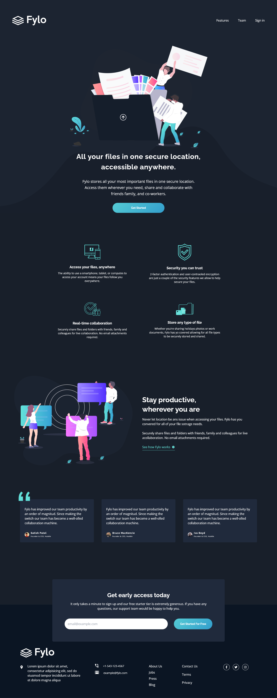

# Front-End Mentor | Fylo landing page

This is a solution to the Fylo landing page. The challenge is from [Front-end Mentor.]()

## Developing

### What I learned

### Challenge consists of

### Technologies used in the project

1. [React](https://es.reactjs.org/) + [TypeScript](https://www.typescriptlang.org/)
1. [styled-components](https://styled-components.com/)
1. [Vite](https://vitejs.dev/)

## Demo

🖥 If you want to see the solution, [click here]().
 
🌎 If you want to see the solution in Frontend Mentor, [click here]().

### Screenshots

## Author

- Harvey Yerik
  - [Portfolio](portfolio-harvey.netlify.com)
  - [Front End Mentor](https://www.frontendmentor.io/profile/YerikAH)
  - [Twitter](https://twitter.com/yerikhar)
  - [GitHub](https://github.com/YerikAH)
